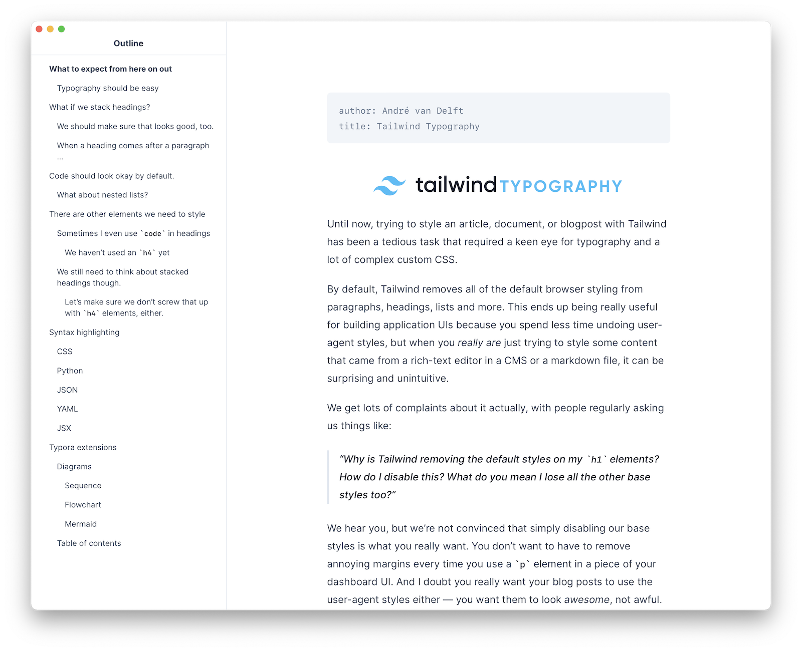
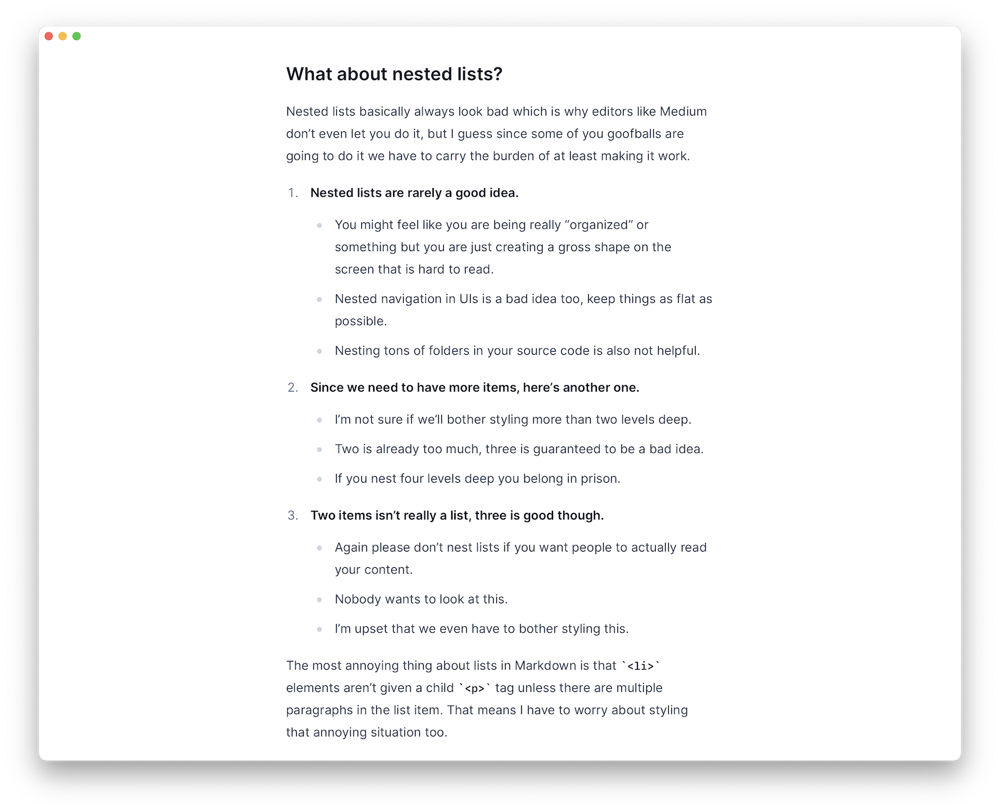
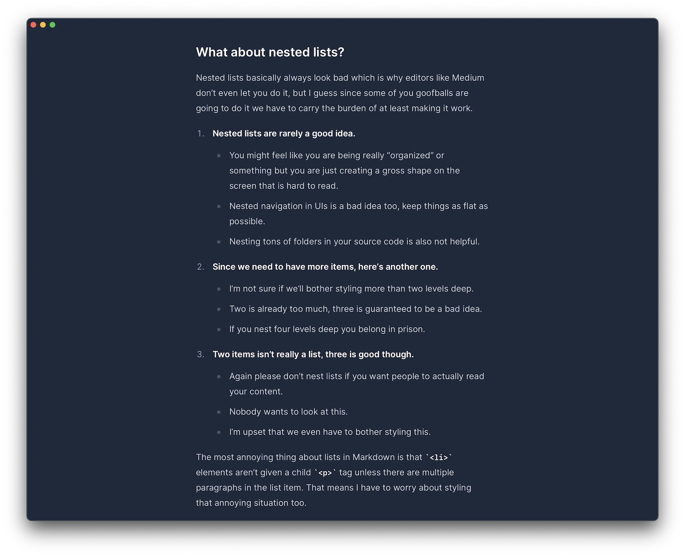
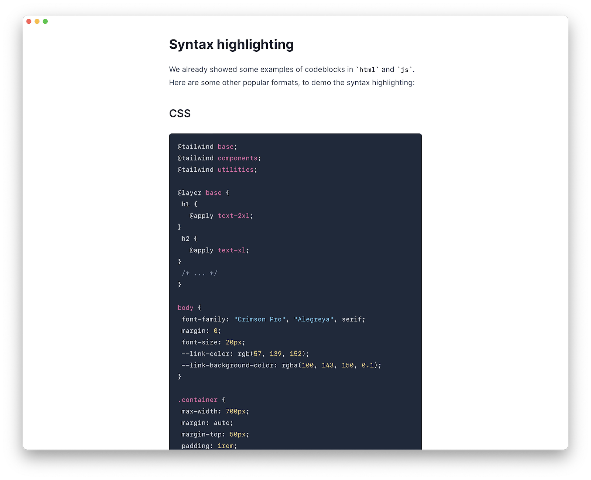
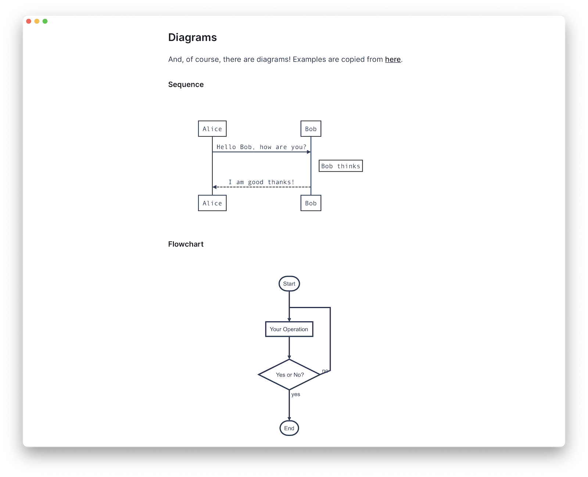
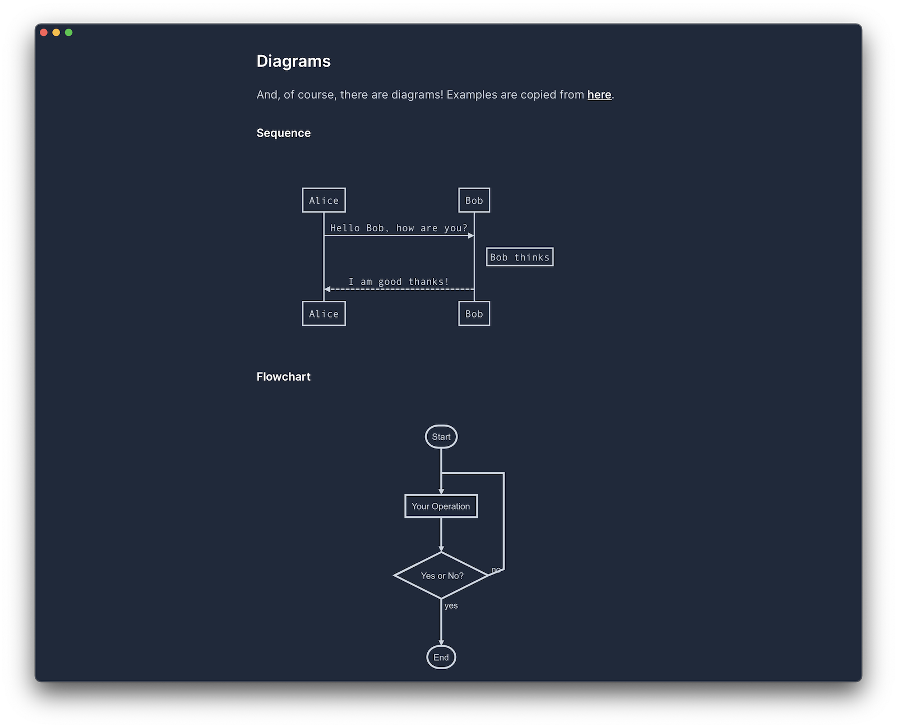
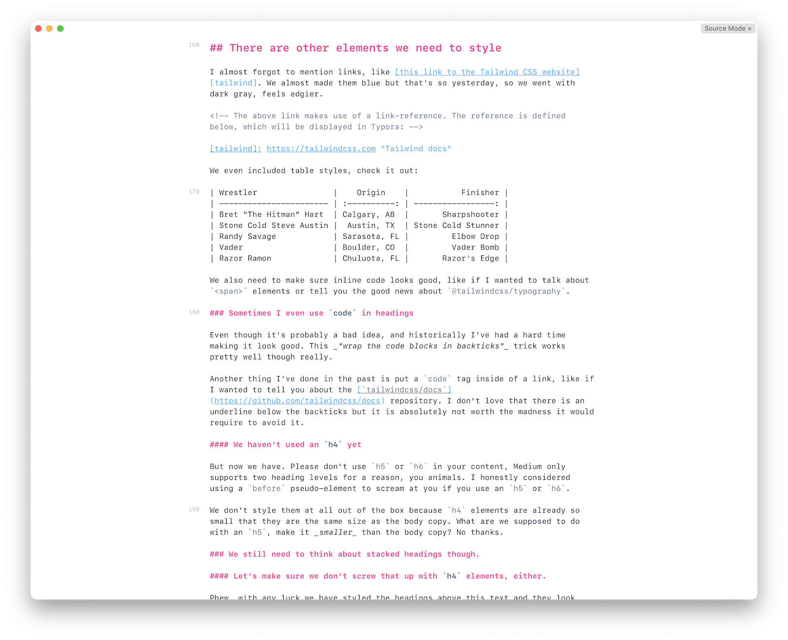
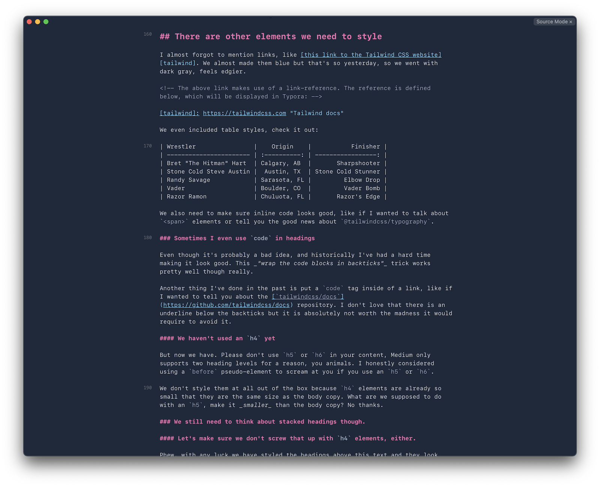

# Tailwind theme for Typora

An implementation of the beautiful [Tailwind Typography](https://tailwindcss.com/docs/typography-plugin) layout for [Typora](https://typora.io):


A light and dark theme are provided, which use the `prose-xl` class and `slate` grayscale. In particular, the themes are equivalent to:

```html
<article class="prose prose-xl prose-slate dark:prose-invert dark:bg-slate-800">
  ...
</article>
```

## Installation

1. Go to the Typora theme folder (reachable via the settings menu: Appearance > Open theme folder)
2. Copy the contents of `dist/` into this folder.
3. Restart Typora and select either 'Tailwind' or 'Tailwind Dark' from the 'Theme' menu.

## Customization

As with any theme, the Tailwind and Tailwind Dark themes can be customized by defining rules in `tailwind.user.css` and `tailwind-dark.user.css` respectively. In this particular case, `tailwind.user.css` will also be imported by the Tailwind Dark theme, such that customizations will be applied uniformly. If one only wants to target the light theme, rules can be defined in `tailwind-light.user.css`.

### Grayscale

The `slate` grayscale can be modified by overriding the `--theme-X` variables in `tailwind.user.css` as follows:

```css
:root {
  /* Zinc grayscale */
  --theme-50: #fafafa;
  --theme-100: #f4f4f5;
  --theme-200: #e4e4e7;
  --theme-300: #d4d4d8;
  --theme-400: #a1a1aa;
  --theme-500: #71717a;
  --theme-600: #52525b;
  --theme-700: #3f3f46;
  --theme-800: #27272a;
  --theme-900: #18181b;
}
```

Note that both the light and dark theme automatically adjust to this grayscale.

Refer to the [Tailwind docs](https://tailwindcss.com/docs/background-color) for other grayscales (or define your own).

### Font

The default Tailwind font is [Inter](https://rsms.me/inter). A different font-family, as well as general adjustments like font-size and line-height can be defined using the `#write` selector:

```css
#write {
  font-family: "Crimson Pro";
  font-size: 1.6rem;
  line-height: 1.6;
}
```

I personally find that the Tailwind theme works very well with a serif font like [Crimson Pro](https://fonts.google.com/specimen/Crimson+Pro).

If the chosen font is not in proportion to the monospace font (as is the case with Crimson Pro), one can change this balance by adjusting the monospace font-size through the following variables:

```css
#write {
  --code-blocks-font-size: 0.65em;
  --inline-code-font-size: 0.75em;
}
```

Additionally, the monospace font-family can be customized through the `--monospace` variable.


## Screenshots

### Outline




### Lists





### Other styles




### Extensions






### Source code mode





